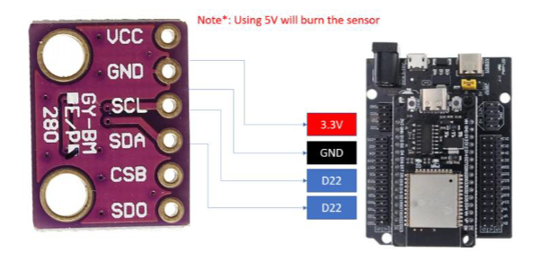
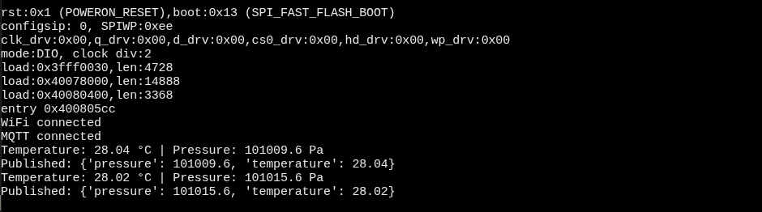
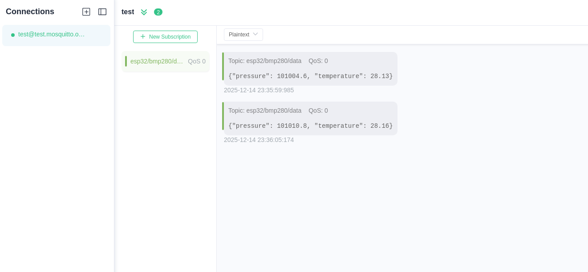
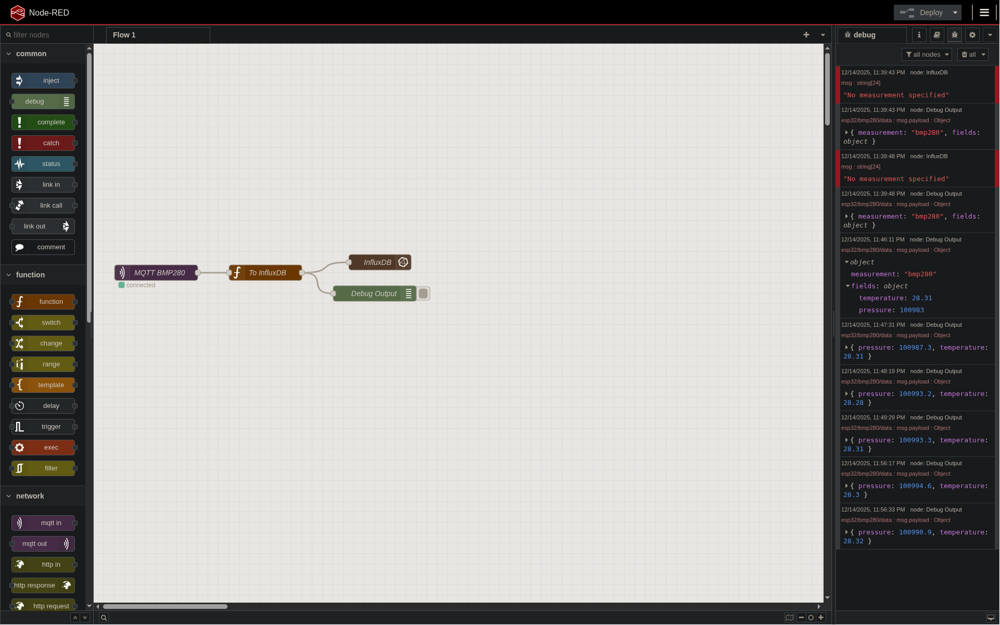
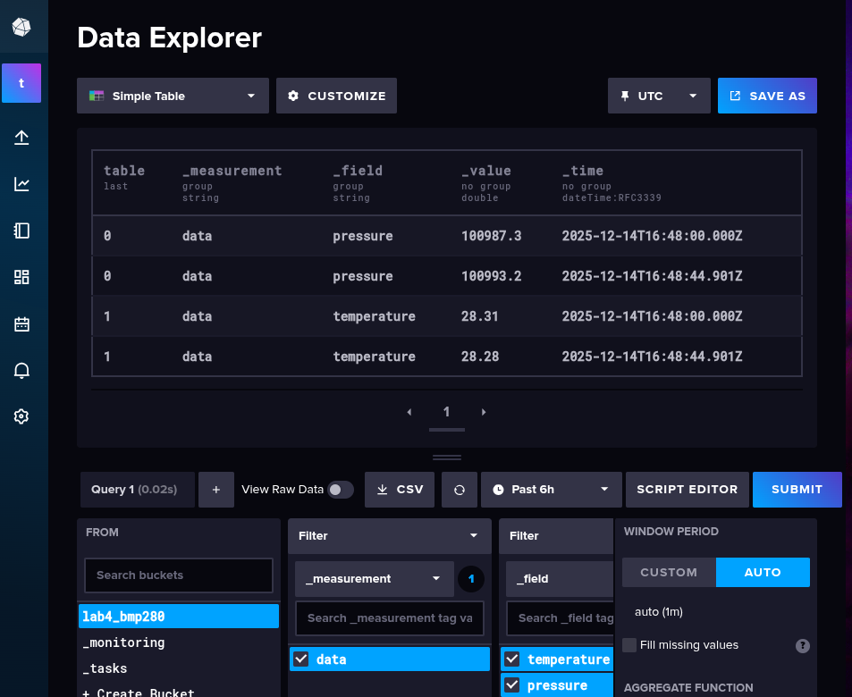
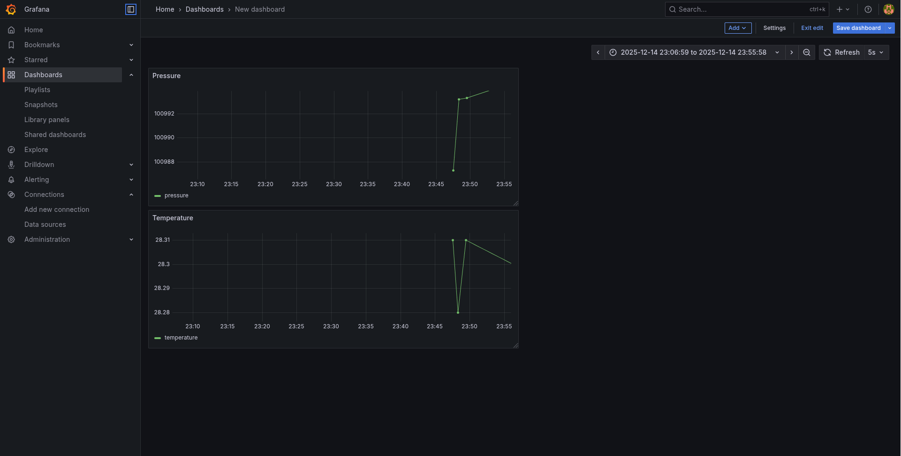

## 1. Wiring

* **SDA** → ESP32 GPIO 21
* **SCL** → ESP32 GPIO 22
* **VCC** → 3.3V
* **GND** → GND



---

## 2. Task Execution

### Task 1 – BMP280 Read & Print

**Evidence:**



---

### Task 2 – MQTT Publish

**Evidence:**



---

### Task 3 – Node-RED Flow

**Evidence:**



---

### Task 4 – InfluxDB Setup

* Username: `test`
* Password: `test`
* Organization name: `test`
* Created bucket: `lab4_bmp280`
* Configured authentication token

**Evidence:**



---

### Task 5 – Grafana Dashboard

**Evidence:**



---

## 4. Data Pipeline Diagram

The overall data flow for this lab is:

```
ESP32 (BMP280)
    → MQTT Broker
        → Node-RED
            → InfluxDB
                → Grafana Dashboard
```

---

## 5. Files Submitted

* [ESP32 Python Code](./src/main.py)
* [Node-RED flow JSON](./src/nodered.json)
* [Demo Video](./media/demo.mp4)
